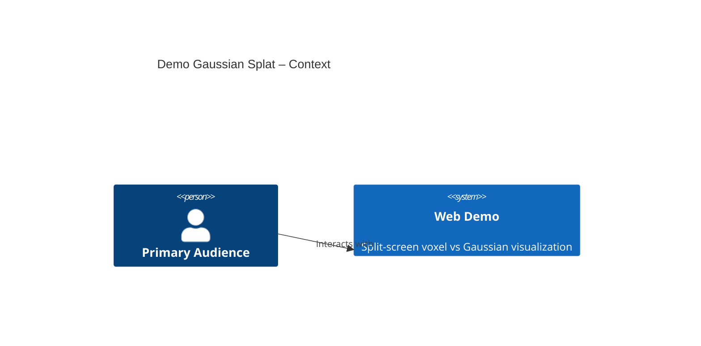
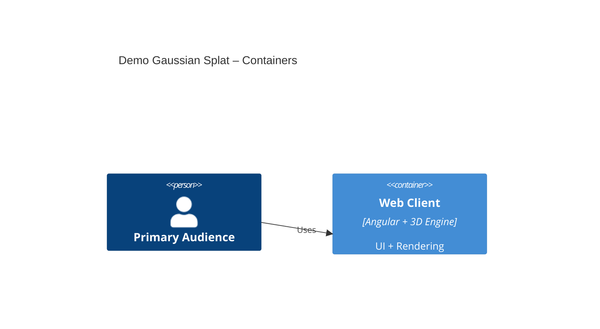
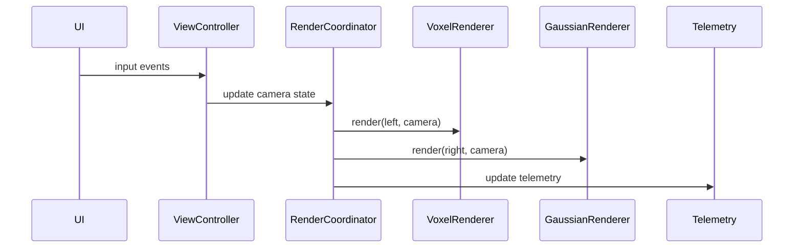

Restated Inputs (Macro-Level Plan Summary, Constraints, NFRs)
- Goal: Build {Project_Name} as an interactive web demo for {Reference_Paper} showing sparse 3D Gaussian primitives are more bandwidth-efficient than dense voxel methods for collaborative perception, and communicate the message within ~10 seconds.
- Users/Stakeholders: {Stakeholder_Group_A} (paper authors), {Stakeholder_Group_B} (lab PI), {Primary_Audience} (funding reviewers).
- Core capabilities: split-screen comparison (fixed 50/50); independent orbit/zoom/pan controls per view; procedural scene; dense voxel rendering; Gaussian shader per Equation 7 with semantics; HUD with bandwidth/accuracy; summary text section; on-screen citation link.
- Visual: dark-mode technical dashboard (background #121212), bright semantic colors for Gaussians, muted translucent voxels, neon accents.
- Constraints: Angular + 3D engine on Vercel (free tier); self-contained data with no external APIs/assets; desktop/laptop focus; mobile best-effort viewability.
- Traffic: Low.
- NFRs: performance best-effort with target 60 fps on a standard laptop; availability 90% uptime; observability with configurable logging and a UI toggle; security/privacy/accessibility/i18n not required for MVP.
- Out of scope: real-time ML inference, external asset loading, full CUDA 3DGS pipeline, backend services/DBs, mobile-first UX, Concept 2/3 features.
- Success: Gaussian view appears cleaner and more object-centric than voxel view; message understood within ~10 seconds; best-effort performance with a faithful Equation 7 shader.

Open Questions and Blocked Decisions
- Confirm final values for placeholders: {Project_Name}, {Reference_Paper} title, and {Primary_Audience} labels.
- Confirm minimum acceptable mobile behavior beyond “best-effort” (e.g., view-only vs. limited touch controls).
- Confirm preferred logging levels if different from the proposed error/warn/info/debug set.

1. Architecture Overview and Rationale
- Selected pattern: client-only, layered modular web application (presentation + rendering engine + scene model), implemented as a modular monolith within the browser.
- Rationale: low traffic, no backend or data persistence required, self-contained assets, and the need for tight render-loop control for best-effort performance.
- Alternatives considered:
  - Client + backend analytics: adds complexity and violates “no backend services.”
  - Microservices: overkill and conflicts with scope/out-of-scope.
  - WASM-heavy render core: possible but adds build complexity without a macro-level mandate.
- Alignment: client-only architecture aligns with constraints (self-contained, no external APIs), supports deployment on Vercel static hosting, and minimizes latency for real-time rendering.

2. System Decomposition
- UI Shell
  - Responsibilities: layout, fixed 50/50 split container, HUD, summary text, citation link, log panel toggle, theme.
  - Inputs/Outputs: user interactions -> render state updates.
- View Controller (per panel)
  - Responsibilities: independent camera orbit/pan/zoom, input mapping, view state.
  - Inputs/Outputs: UI events -> camera matrices; emits view state to renderer.
- Scene Generator
  - Responsibilities: procedural scene (road, ego vehicle, obstacle) and semantic labels.
  - Inputs/Outputs: config params -> voxel grid + Gaussian primitives.
- Voxel Renderer
  - Responsibilities: dense voxel grid rendering with semi-transparent cluttered look.
  - Inputs/Outputs: voxel grid + camera matrices -> left panel render.
- Gaussian Renderer
  - Responsibilities: Equation 7 shader using mean/scale/rotation/opacity/semantics; semantic coloring.
  - Inputs/Outputs: Gaussian primitives + camera matrices -> right panel render.
- Render Coordinator
  - Responsibilities: orchestrates per-panel render passes, manages resize/fixed split ratio, frame loop.
- Telemetry/Bandwidth Estimator
  - Responsibilities: compute bandwidth and accuracy HUD values from visible primitive counts and configured ratios; update on interaction.
- Logging/Diagnostics
  - Responsibilities: level-based logging, ring buffer for log entries, UI panel toggle.
- Config/Settings
  - Responsibilities: constants for colors, counts, defaults, and feature toggles.

Communication
- Mostly synchronous in-process calls.
- Event-driven UI updates for camera controls; render loop drives renderers and telemetry updates.

C4 (Context) – Mermaid

C4 (Container) – Mermaid

3. Data and Interface Design
- Domain model
  - Scene: terrain, ego vehicle, obstacle, semantics.
  - VoxelGrid: 3D grid with occupancy/opacity/semantic class.
  - GaussianPrimitive: mean (vec3), scale (vec3), rotation (quat), opacity, semantic class.
  - ViewState: camera pose, projection params, input state.
  - RenderConfig: colors, target counts, fixed split ratio (0.5), HUD settings.
  - TelemetryState: bandwidth baseline/gaussian values, baseline/ours mIoU, delta, FPS.
  - LogEntry: timestamp, level, message.
- Storage
  - In-memory only; no persistence.
  - Logging: ring buffer in memory for the UI log panel.
- Core schemas (outline)
  - VoxelGrid default: 64x64x32 (~131k voxels), adjustable for performance.
  - Gaussian count default: ~3k (2k–5k range), adjustable for performance/clarity.
- Interfaces
  - UI -> RenderCoordinator: setCameraState(panel, state).
  - RenderCoordinator -> Renderers: render(frameCtx).
  - SceneGenerator -> Renderers: getVoxelGrid(), getGaussians().
  - Telemetry: updateFromVisibleCounts(leftCount, rightCount) -> HUD values.
  - Logging: log(level, message); UI toggle to show/hide log panel.
- Data flows
  1) Init -> SceneGenerator produces voxel grid + Gaussians.
  2) Render loop -> per-panel renderers draw using camera matrices.
  3) Telemetry estimator updates bandwidth values based on visible counts per frame or interaction.
  4) UI events -> ViewController -> state updates -> next frame render.
  5) Logs -> Log buffer -> UI panel (toggle).

Sequence (render loop) – Mermaid

4. Technology Choices and Rationale
- Web framework: Angular (required for a website).
- 3D engine options:
  1) Three.js (recommended) – mature WebGL abstraction, straightforward custom shader integration.
  2) Babylon.js – robust tooling, heavier footprint.
  3) Raw WebGL2 – max control/perf, higher dev effort.
- Hosting: Vercel (free tier) as the primary target; alternatives include Netlify or GitHub Pages if needed.
- Recommendation: Angular + Three.js on Vercel for maintainability and shader flexibility under low-traffic constraints.

5. Integration Points
- External systems: none required by macro plan.
- On-screen citation link to {Reference_Paper} (TBD URL) with safe target handling.
- Protocols/auth: N/A (no backend).
- Error handling: in-app logging with configurable levels; no retries needed.

6. Deployment and Runtime Architecture
- Environments: dev/prod (optional stage if needed). Config via Angular environment files.
- Packaging: static build artifacts.
- Deployment: Vercel static hosting with preview builds for branches.
- CI/CD: trunk-based with lint/build/test; artifact versioning via tags/releases.
- Observability: console logging with levels and a UI log panel toggle; optional FPS counter.

7. Non-Functional Requirements Mapping
- Performance (best-effort, target 60 fps): instanced rendering, frustum culling, adjustable voxel/Gaussian counts, optimized Equation 7 shader, requestAnimationFrame loop.
- Availability (90% uptime): static hosting on Vercel; no backend dependencies.
- Observability: level-based logging and UI log panel toggle.
- Browser support: Chrome, Edge, Firefox, Safari; test WebGL2 compatibility and provide graceful fallback messaging.
- Security/privacy/accessibility/i18n: explicitly out of scope for MVP; document as deferred.
- Maintainability: modular renderers and typed models with clear interfaces.

8. Risks, Assumptions, and Open Questions
- Risks: Equation 7 shader or Safari WebGL performance may reduce frame rate; mitigate with adjustable counts and quality presets.
- Assumptions: no backend required; Vercel hosting is acceptable; accuracy values will be sourced from the paper.
- Open questions: see “Open Questions and Blocked Decisions.”

9. Traceability Matrix
- Split-screen comparison (fixed 50/50) + independent controls -> UI Shell, ViewController, Render Coordinator.
- Procedural scene -> Scene Generator.
- Dense voxels -> Voxel Renderer.
- Equation 7 Gaussians -> Gaussian Renderer.
- HUD (bandwidth + accuracy) -> Telemetry/Bandwidth Estimator + UI Shell.
- Logging + UI toggle -> Logging/Diagnostics.
- On-screen citation -> UI Shell.
- Self-contained/no external APIs -> client-only architecture.

10. Readiness for Micro-Level Planning
- Workstreams/Epics
  1) Angular + Three.js setup
  2) Scene generator + data models
  3) Voxel renderer
  4) Gaussian renderer (Equation 7)
  5) UI shell + fixed split + HUD + citation link
  6) Telemetry + logging panel
  7) Performance tuning and cross-browser validation
- Entry criteria: confirm baseline/ours mIoU values and citation URL; finalize mobile behavior expectations; confirm logging levels.
- Exit criteria: both views render with fixed split; HUD and log panel functional; best-effort performance validated on target browsers.
- Critical path: engine setup -> scene generator -> renderers -> UI shell/HUD -> telemetry/logging -> perf tuning.

11. Diagrams (as needed)
- Included: C4 context/container diagrams and render-loop sequence.

12. Out of Scope for Meso-Level
- Code-level design, class/function signatures, and test cases.
- Detailed acceptance criteria per story (defer to micro-level).
- Environment-specific secrets and per-service configuration minutiae.
