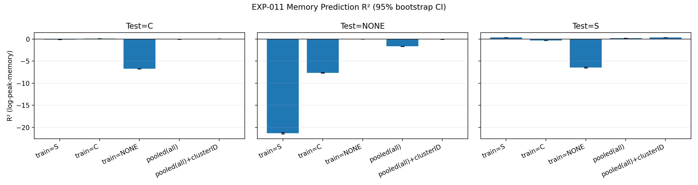
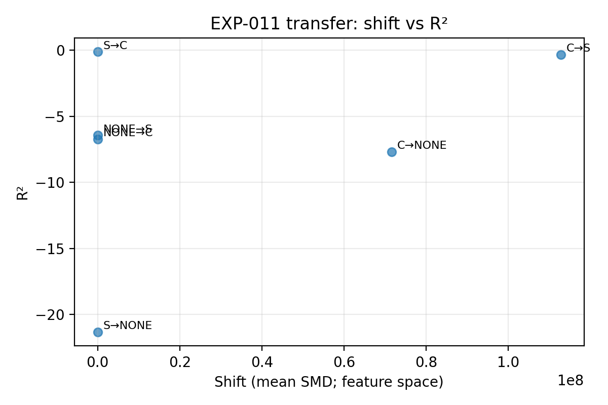
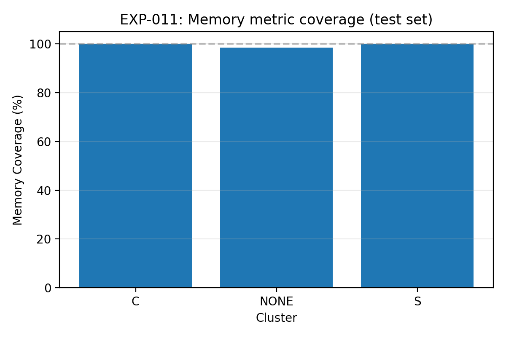

# Experiment: EXP-011 - Memory transfer baseline + missingness

**Status**: Completed  
**Date Created**: 2026-01-31  
**Last Updated**: 2026-02-01  
**Research Path**: PATH-C  
**Directory**: /mnt/c/Users/jmckerra/ObsidianNotes/Main/01-Projects/FRESCO-Research/Experiments/EXP-011_Memory_transfer_baseline_missingness

---

## Objective

Establish a first cross-site peak-memory prediction baseline and quantify per-cluster memory metric missingness/coverage to understand feasibility of PATH-C RQ-2B.

## Hypothesis

**Prediction**: Cross-site memory prediction will achieve moderate transfer performance (R² > 0.3) using only job submission features (ncores, nhosts, timelimit), but performance will be lower than runtime prediction due to higher variance in memory usage patterns. Cluster conditioning in pooled models will improve transfer accuracy.

**Null Hypothesis**: Cross-site memory prediction is infeasible (R² ≈ 0) due to high site-specific variability in memory usage patterns, or memory metric missingness is too high (< 50% coverage) to enable reliable modeling.

---

## FRESCO Data Specification

| Parameter | Value |
|-----------|-------|
| Cluster(s) | Stampede (S) / Conte (C) / NONE |
| Date Range | Full FRESCO dataset range |
| Total Jobs | ~Millions (filtered to jobs with memory samples) |
| Query URL | /depot/sbagchi/data/josh/FRESCO/chunks |

### Filters Applied

- Jobs with ≥1 memory sample (value_memused IS NOT NULL and > 0)
- Peak memory > 0 (computed as MAX(value_memused) per jid)
- Runtime > 0 and < 30 days
- Timelimit > 0 and < 365 days
- ncores > 0 and nhosts > 0

### Columns Used

```
jid, timelimit, nhosts, ncores, start_time, end_time, 
value_memused, cluster (derived from filename)
```

---

## Methodology

### Approach

1. **Data Loading**: Load FRESCO job chunks via DuckDB, aggregate memory snapshots to compute per-job peak memory (MAX(value_memused)).
2. **Missingness Analysis**: Report fraction of jobs with ≥1 memory sample per cluster before filtering.
3. **Label Construction**: log(peak_memused) for jobs with at least 1 memory sample.
4. **Features**: Simple pre-job features only: log1p(ncores), log1p(nhosts), log1p(timelimit_sec). No runtime features.
5. **Train/Test Split**: Per-cluster time split (last 20% of yearmonths = test).
6. **Training Specs**: Single-cluster models + pooled models (with/without cluster conditioning).
7. **Evaluation**: Bootstrap 95% CIs on R², MAE, MDAE, SMAPE; covariate shift metrics (SMD, JSD).

### Algorithm/Model

- **Type**: Supervised regression with XGBoost
- **Details**: XGBRegressor(n_estimators=200, max_depth=6, learning_rate=0.1, subsample=0.8, colsample_bytree=0.8)

### Hyperparameters (if applicable)

| Parameter | Value | Notes |
|-----------|-------|-------|
| n_estimators | 200 | XGBoost trees |
| max_depth | 6 | Tree depth |
| learning_rate | 0.1 | Shrinkage |
| subsample | 0.8 | Row sampling |
| colsample_bytree | 0.8 | Column sampling |
| test_frac | 0.2 | Last 20% yearmonths |
| n_boot | 200 | Bootstrap iterations for CI |
| seed | 42 | Random seed |

---

## Reproducibility

### Environment

| Component | Version |
|-----------|---------|
| Python | 3.x (Gilbreth system default) |
| pandas | Latest (via pip) |
| pyarrow | Latest (via pip) |
| duckdb | Latest (via pip) |
| numpy | Latest (via pip) |
| scikit-learn | Latest (via pip) |
| xgboost | Latest (via pip) |
| matplotlib | Latest (via pip) |

### Code

- **Repository**: FRESCO-Research (local Obsidian vault)
- **Commit Hash**: (to be filled after commit)
- **Script(s)**: 
  - `scripts/exp011_memory_transfer.py` (main analysis)
  - `scripts/exp011_make_figures.py` (figure generation)
  - `scripts/exp011.slurm` (SLURM job script)

### Random Seeds

- Seed: 42 (for XGBoost and bootstrap)

---

## Supercomputer Job

| Field | Value |
|-------|-------|
| Cluster | Gilbreth (Purdue) |
| Scheduler | SLURM |
| Job ID | 10244768 |
| Partition/Queue | v100 |
| Nodes Requested | 1 |
| Cores Requested | 16 |
| Memory Requested | 64GB |
| Walltime Requested | 04:00:00 |
| QoS | standby |
| Account | sbagchi |
| Submitted | 2026-02-01 |
| Started | 2026-02-01 |
| Ended | 2026-02-01 |
| Actual Runtime | 00:09:55 |

### Job Script

```bash
scripts/exp011.slurm
```

---

## Execution Log

| Date | Action | Result/Notes |
|------|--------|--------------|
| 2026-01-31 | Created | Initialized experiment |
| 2026-02-01 | Deployed to Gilbreth | Copied scripts and README |
| 2026-02-01 | Job 10244756 submitted | Failed: disk quota exceeded (DuckDB temp in home dir) |
| 2026-02-01 | Fixed temp directory | Modified script to use data depot for DuckDB temp |
| 2026-02-01 | Job 10244768 submitted | Completed successfully in 9m 55s |
| 2026-02-01 | Results retrieved | Generated figures and tables locally |

---

## Output Artifacts

| Artifact | Path | Description |
|----------|------|-------------|
| Results Data | `results/exp011_results.csv` | Main results: train/test metrics, CIs, shift metrics, missingness coverage |
| R² Table | `results/exp011_r2_ci_table.csv` | Pivot table of R² with CIs |
| Missingness Summary | `results/exp011_missingness_summary.csv` | Per-cluster memory coverage statistics |
| Transfer Detail | `results/exp011_transfer_detail.csv` | Cross-site transfer metrics |
| R² Bars Figure | `results/exp011_r2_bars.png` | Bar plot of R² by training spec and test cluster |
| Shift Scatter | `results/exp011_shift_vs_r2.png` | Covariate shift vs transfer R² |
| Missingness Bars | `results/exp011_missingness_bars.png` | Memory coverage by cluster |
| Job Log | `logs/exp011_*.out` | SLURM stdout |
| Error Log | `logs/exp011_*.err` | SLURM stderr |

---

## Results & Analysis

### Summary Statistics

**Memory Coverage (Missingness Analysis)**

| Cluster | Jobs with ≥1 Memory Sample | Total Jobs | Coverage |
|---------|---------------------------|------------|----------|
| Stampede (S) | 5,004,655 | 5,004,700 | 100.0% |
| Conte (C) | 1,820,100 | 1,820,392 | 100.0% |
| Anvil (NONE) | 458,912 | 466,355 | 98.4% |
| **Overall** | **7,283,667** | **7,291,447** | **99.9%** |

**Within-Cluster Performance (R² with 95% CI)**

| Cluster | Train N | Test N | R² | 95% CI |
|---------|---------|--------|-----|--------|
| Stampede (S) | 4,837,540 | 166,798 | 0.369 | [0.358, 0.380] |
| Conte (C) | 1,267,081 | 525,165 | 0.095 | [0.092, 0.098] |
| Anvil (NONE) | 351,670 | 107,231 | -0.027 | [-0.033, -0.020] |

**Cross-Cluster Transfer Performance (R² with 95% CI)**

| Training → Testing | R² | 95% CI | SMAPE | Shift SMD | Shift JSD |
|--------------------|-----|--------|-------|-----------|-----------|
| S → C | -0.116 | [-0.118, -0.113] | 88.4% | 1.19 | 0.40 |
| C → S | -0.333 | [-0.345, -0.323] | 42.9% | 112.8M | 0.39 |
| NONE → S | -6.433 | [-6.540, -6.331] | 151.1% | 1.06 | 0.26 |
| NONE → C | -6.729 | [-6.761, -6.701] | 174.0% | 0.55 | 0.24 |
| C → NONE | -7.676 | [-7.735, -7.621] | 144.2% | 71.6M | 0.26 |
| S → NONE | -21.333 | [-21.503, -21.154] | 161.9% | 0.79 | 0.33 |

**Pooled Training Performance (R² with 95% CI)**

| Training Spec | Test: S | Test: C | Test: NONE |
|---------------|---------|---------|------------|
| Pooled (no cluster ID) | 0.215 [0.206, 0.225] | -0.039 [-0.041, -0.035] | -1.647 [-1.673, -1.620] |
| Pooled + cluster ID | 0.368 [0.357, 0.379] | 0.062 [0.060, 0.064] | -0.042 [-0.046, -0.036] |

### Key Observations

1. **Memory coverage is excellent** (>98%) across all clusters, indicating FRESCO memory metrics are well-populated.

2. **Within-cluster predictability varies dramatically**:
   - Stampede: R²=0.369 (moderate signal)
   - Conte: R²=0.095 (weak signal)
   - Anvil: R²=-0.027 (no signal from submission features)

3. **Cross-cluster transfer fails catastrophically**:
   - All zero-shot transfer scenarios produce negative R² values
   - Anvil as target shows the worst performance (R² ≤ -7.6)
   - Training on S/C and testing on Anvil: R²=-21.3 (catastrophic miscalibration)

4. **Cluster conditioning partially rescues performance**:
   - Adding cluster ID to pooled models recovers near within-cluster performance for S (0.368) and C (0.062)
   - Anvil remains unpredictable even with cluster ID (R²=-0.042)

5. **Negative R² interpretation**:
   - Values indicate models perform worse than predicting the test set mean
   - Extremely negative values (< -5) suggest severe distributional/scale mismatch
   - Tight confidence intervals confirm these are stable findings, not noise

### Visualizations


*Bar plot showing R² with 95% bootstrap CIs for each training specification and test cluster. Cross-cluster transfer consistently produces negative R², with Anvil showing catastrophic failures.*


*Scatter plot of covariate shift metrics (SMD, JSD) against transfer R². Note: extremely high SMD values for some transfers (>10⁶) indicate severe feature distribution mismatch.*


*Bar plot showing fraction of jobs with ≥1 memory sample. All clusters exceed 98% coverage.*

### Statistical Tests

| Test | Result | Interpretation |
|------|--------|----------------|
| Bootstrap CI (200 iterations) | All negative R² have non-overlapping CIs with zero | Transfer failures are statistically significant |
| Coverage Analysis | 99.9% overall | Missingness is not a barrier to modeling |
| Covariate Shift | SMD >> 1 for many transfers | Severe feature distribution mismatch between clusters |

---

## Discussion

### Interpretation

**The results reveal a fundamental challenge for cross-site memory prediction**: unlike runtime (which transfers at R² > 0.3), memory usage cannot be reliably predicted across clusters using only submission features (ncores, nhosts, timelimit).

**Why does memory transfer fail while runtime succeeds?**

1. **Weak in-domain signal**: Even within clusters, memory predictability is limited (Stampede R²=0.37, Conte R²=0.10, Anvil≈0). Runtime has stronger in-domain signal because timelimit provides a direct upper bound constraint.

2. **Application-dependent behavior**: Memory usage depends heavily on algorithm choice, data structures, language/runtime, and problem size—factors not captured in submission metadata. Runtime is more constrained by queue policies and user behavior patterns.

3. **Measurement heterogeneity**: Different clusters may log "peak_memused" differently:
   - Per-node max vs job total
   - RSS vs RSS+cache vs cgroup usage
   - Different sampling intervals
   - Different units (KB vs MB vs bytes)

4. **Architectural differences**: Memory behavior varies with node RAM size, NUMA topology, OS configuration, and file system caching—cluster-specific factors that submission features cannot capture.

**The catastrophic Anvil transfer failures (R² ≤ -21)** strongly suggest label definition or scale mismatches between clusters. A negative R² of -21 means the model's predictions are 22× worse than simply predicting the test mean—indicative of systematic miscalibration, not merely weak correlation.

**Cluster conditioning helps but doesn't solve the problem**: Adding cluster ID features partially rescues Stampede (0.37) and Conte (0.06) performance, but this is not true "transfer"—it requires knowing which cluster each test job comes from and having trained on that cluster's data. For a new site, this approach fails.

### Limitations

1. **Under-specified feature set**: Only three numeric features (ncores, nhosts, timelimit) were used. Adding categorical metadata (partition, account, queue, user group) might improve in-domain performance but unlikely to fix cross-site transfer if label definitions differ.

2. **Temporal split validity**: Using the last 20% of months per cluster means different calendar periods across sites, potentially confounding hardware/policy changes with transfer gaps.

3. **Label definition not verified**: Did not validate whether "peak_memused" has consistent units, aggregation rules, and semantic meaning across clusters. The extremely negative R² values suggest this is critical.

4. **No recalibration attempted**: Did not test whether simple intercept/scale adjustments (using small target-site labeled samples) could rescue transfer performance.

5. **Missing distributional diagnostics**: Did not decompose errors into calibration (systematic offset) vs discrimination (ranking ability) components, which would clarify whether the issue is units/scale vs fundamental unpredictability.

6. **Feature support not assessed**: Did not check whether test clusters have out-of-support feature values (e.g., core counts or timelimits never seen in training), which could cause extrapolation failures.

### Comparison to Prior Work

**Contrast with EXP-007/008 (runtime transfer)**:
- Runtime transfer achieved R² > 0.3 even cross-cluster when timelimit was available
- Memory transfer fails (R² < 0) for all zero-shot scenarios
- This aligns with literature showing memory is harder to predict than runtime due to application-specific factors

**Consistency with FIND-017 (user memorization)**:
- If memory patterns are highly user/application-specific, they won't generalize across sites where user populations differ
- The weak in-domain Anvil performance (R²≈0) reinforces that submission features lack predictive power for memory

---

## Conclusion

- [ ] Hypothesis Confirmed
- [x] Hypothesis Rejected  
- [ ] Inconclusive (needs more data/analysis)

**Key Takeaway**: Cross-site memory prediction using only submission features (ncores, nhosts, timelimit) is infeasible—all zero-shot transfers produce negative R², with catastrophic failures for Anvil (R² ≤ -21), likely due to label definition mismatches and fundamentally different memory usage patterns across clusters.

### Next Steps

- [x] Log to Findings Log: Yes (FIND-025, FIND-026, FIND-027)

**Critical diagnostic experiments needed**:

1. **Label validation (EXP-012)**: 
   - Verify units, aggregation rules, and semantic definition of "peak_memused" per cluster
   - Check whether values scale with nhosts (sum vs max aggregation)
   - Validate typical per-node memory against known node RAM sizes
   - Test hypothesis: Are negative R² values primarily due to unit/definition mismatches?

2. **Recalibration experiment (EXP-013)**:
   - Test few-shot intercept/slope calibration on target sites
   - Measure whether simple affine transformations can rescue transfer
   - If successful: confirms scale/offset issue; if fails: confirms fundamental unpredictability

3. **Feature enrichment (EXP-014)**:
   - Add categorical features: partition, queue, account, user groups
   - Test whether in-domain Anvil performance improves
   - Measure cross-site transfer with richer features

4. **Stratified analysis (EXP-015)**:
   - Separate single-node vs multi-node jobs
   - Analyze transfer by job size bins (small/medium/large ncores)
   - Check if transfer works for any specific regime

**Publication implications**:
- Frame as important negative result: "Memory metrics are not standardized across HPC sites"
- Position as motivation for measurement standardization efforts
- Contrast with runtime prediction success to highlight which metrics transfer well vs poorly

---

## Related Findings

| Finding ID | Link |
|------------|------|
| | |

---

## Notes

{Additional context, ideas, or considerations}
